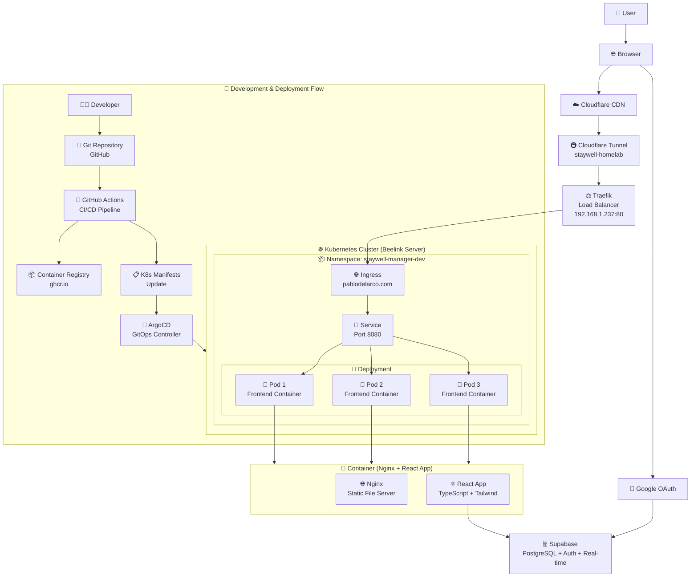
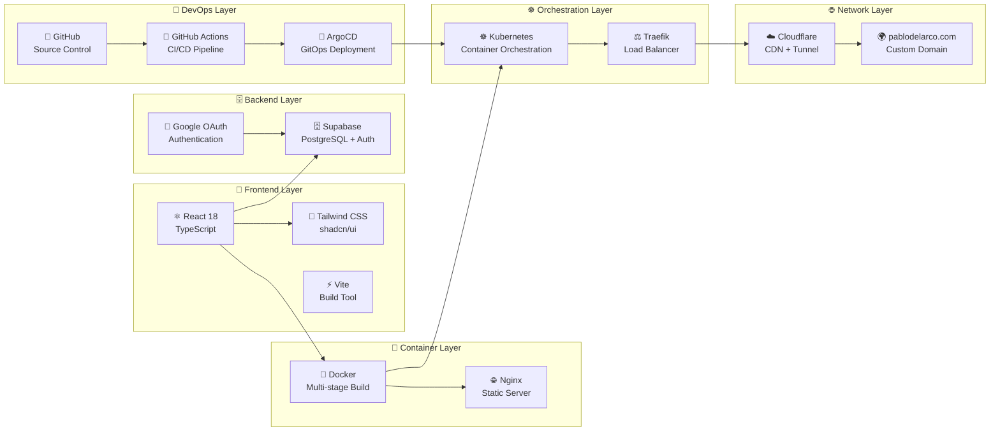
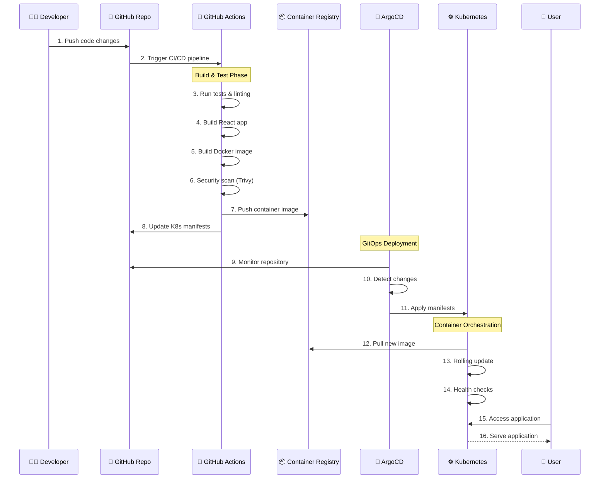

# 🏥 StayWell Manager – Cloud-Native SaaS Platform

**StayWell Manager** is a modern health and wellness management platform deployed on Kubernetes with a complete GitOps-powered CI/CD pipeline. This project demonstrates enterprise-grade cloud-native architecture, automated deployments, and modern DevOps practices.

🌐 **Live Demo**: [pablodelarco.com](https://pablodelarco.com)

## ✨ Features

- 🔐 **Secure Authentication**: Google OAuth integration via Supabase
- 📱 **Responsive Design**: Mobile-first UI with Tailwind CSS and shadcn/ui
- 🏠 **Property Management**: Apartments, tenants, and lease tracking
- 💰 **Financial Management**: Bills, payments, and financial reporting
- 📊 **Analytics Dashboard**: Comprehensive reports and insights
- ⚡ **Real-time Updates**: Live data synchronization with Supabase
- 🔒 **Enterprise Security**: Container scanning, HTTPS, and secure authentication
- 🚀 **Auto-scaling**: Kubernetes horizontal pod autoscaling
- 🌍 **Global CDN**: Cloudflare integration for worldwide performance

---

## 🏗️ Architecture & Tech Stack

### Complete System Architecture


### Technology Stack


### Key Technologies
- **Frontend:** React 18 + TypeScript + Vite + Tailwind CSS + shadcn/ui
- **Backend:** Supabase (PostgreSQL + Authentication + Real-time)
- **Authentication:** Google OAuth integration
- **Containerization:** Docker multi-stage builds with Nginx
- **Orchestration:** Kubernetes with Traefik load balancer
- **GitOps:** ArgoCD for declarative deployments
- **CI/CD:** GitHub Actions with automated testing and security scanning
- **Registry:** GitHub Container Registry (GHCR)
- **Security:** Trivy vulnerability scanning, non-root containers
- **Networking:** Cloudflare CDN + Tunnel, custom domain (pablodelarco.com)
- **Infrastructure:** Self-hosted Kubernetes cluster

---

## 🔄 CI/CD & GitOps Workflow

### Deployment Flow


### Workflow Steps
1. **Push to `develop` branch** → Pipeline runs, builds container images, runs security scans, updates dev overlay → ArgoCD syncs to the development environment
2. **Push to `main` branch** → Same pipeline, followed by ArgoCD deployment to production cluster
3. **GitOps at the core**: Ensures deployments remain transparent, auditable, and easily revertible
4. **Automated testing**: ESLint, TypeScript checking, and build validation
5. **Security scanning**: Trivy vulnerability detection on container images
6. **Rolling deployments**: Zero-downtime updates with health checks

---

## 🎯 Why This Project Matters

This project demonstrates:

- **🏗️ Enterprise Architecture**: Complete cloud-native stack with Kubernetes, GitOps, and CI/CD
- **🔒 Security-First Approach**: Container scanning, OAuth authentication, and HTTPS everywhere
- **⚡ Modern Development**: React 18, TypeScript, Tailwind CSS, and component-driven architecture
- **🚀 DevOps Excellence**: Automated testing, building, scanning, and deployment
- **📈 Production-Ready**: Custom domain, CDN, monitoring, and auto-scaling
- **🔄 GitOps Workflow**: Declarative, auditable, and easily revertible deployments
- **🌍 Global Scale**: Cloudflare CDN and tunnel for worldwide accessibility

---

## 🚀 Quick Start

### Prerequisites
- Node.js 18+
- Docker
- Kubernetes cluster
- ArgoCD (for GitOps deployment)

### Local Development
```bash
# Clone the repository
git clone https://github.com/pablodelarco/staywell-manager-e301a7db-1
cd staywell-manager-e301a7db-1

# Install dependencies
npm install

# Start development server
npm run dev

# Run tests and linting
npm test
npm run lint

# Build for production
npm run build:prod
```

### Docker Development
```bash
# Build container locally
docker build -t staywell-manager .

# Run with Docker Compose
docker-compose up --build

# Access application at http://localhost:8080
```

### Kubernetes Deployment
```bash
# Apply Kubernetes manifests
kubectl apply -k k8s/

# Check deployment status
kubectl get pods -n staywell-manager-dev

# View logs
kubectl logs -f deployment/staywell-frontend -n staywell-manager-dev
```

## 🌐 Access Points

- **🌍 Production**: [pablodelarco.com](https://pablodelarco.com)
- **🔧 Development**: `http://localhost:8080` (local)
- **🚀 ArgoCD**: GitOps dashboard for deployment management
- **📊 Kubernetes**: Container orchestration and monitoring

## 📝 Environment Configuration

Create a `.env.local` file for local development:
```bash
VITE_SUPABASE_URL=your_supabase_url
VITE_SUPABASE_ANON_KEY=your_supabase_anon_key
```

For Kubernetes deployment, update the secrets in `k8s/` manifests with your actual Supabase credentials.

---

## 🛠️ Development Tools

- **📦 Package Manager**: npm with lock file for consistent dependencies
- **🔧 Build Tool**: Vite for fast development and optimized production builds
- **🎨 Styling**: Tailwind CSS with shadcn/ui component library
- **📝 Code Quality**: ESLint + TypeScript for code consistency
- **🐳 Containerization**: Multi-stage Docker builds for optimized images
- **☸️ Orchestration**: Kubernetes manifests with Kustomize
- **🔄 Automation**: Makefile for common development tasks

## 📊 Project Stats

- **🏗️ Architecture**: Cloud-native, microservices-ready
- **🔒 Security**: OAuth, HTTPS, container scanning, non-root containers
- **⚡ Performance**: CDN, caching, optimized builds, auto-scaling
- **🌍 Accessibility**: Global CDN, responsive design, PWA-ready
- **🔄 Reliability**: Health checks, rolling updates, GitOps deployments
- **📈 Scalability**: Kubernetes HPA, load balancing, stateless design

## 🤝 Contributing

1. Fork the repository
2. Create a feature branch (`git checkout -b feature/amazing-feature`)
3. Commit your changes (`git commit -m 'Add amazing feature'`)
4. Push to the branch (`git push origin feature/amazing-feature`)
5. Open a Pull Request

## 📄 License

This project is licensed under the MIT License - see the [LICENSE](LICENSE) file for details.

## 🙏 Acknowledgments

- **React Team** for the amazing framework
- **Supabase** for the excellent backend-as-a-service
- **Tailwind CSS** for the utility-first CSS framework
- **shadcn/ui** for the beautiful component library
- **Cloudflare** for the global CDN and tunnel services
- **ArgoCD** for the GitOps deployment platform

---

**Built with ❤️ by [Pablo del Arco](https://pablodelarco.com)**

*Demonstrating modern cloud-native development with enterprise-grade DevOps practices.*
