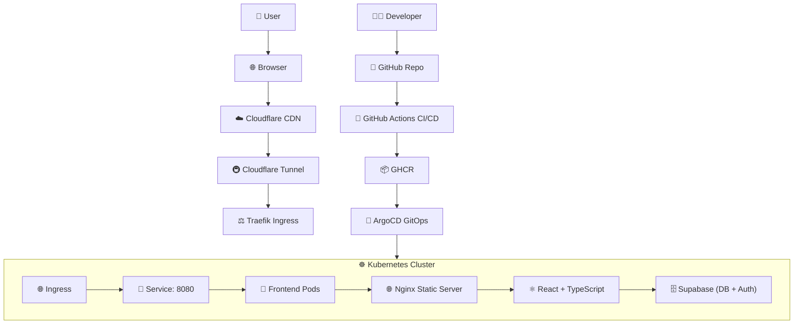
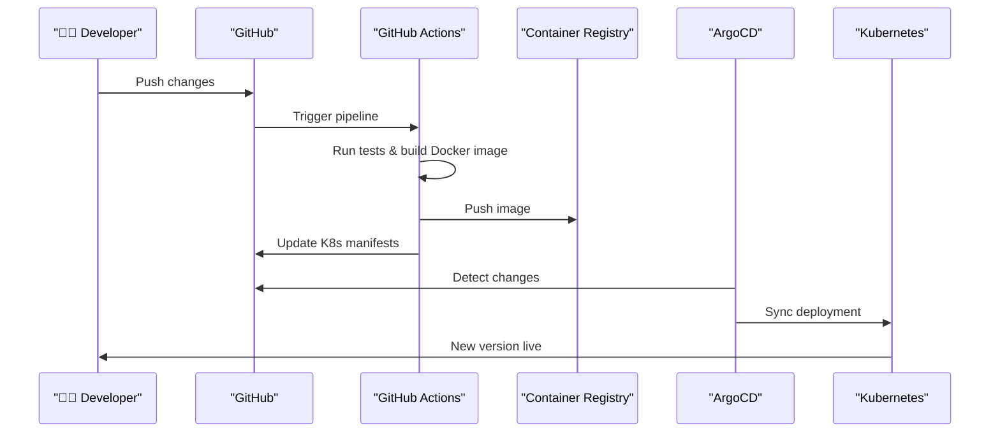

# 🏠 Roomio — Apartment & Tenant Tracker

An open-source webapp to manage rental rooms, tenants, apartments, and payments.
Roomio makes it simple to keep everything in one place, while running on a production-grade cloud-native stack.

  * 🌐 **Live Demo**: [pablodelarco.com](https://pablodelarco.com)
  * 📊 **Tech Backbone**: Kubernetes + ArgoCD + Supabase
  * 🔄 **CI/CD Pipeline**: Automated build, test, and deploy via GitHub Actions

-----

## 🎯 What Roomio Does

  * 🏘️ **Apartments & Rooms**: Manage multiple units and track occupancy.
  * 👥 **Tenants**: Store tenant details, contracts, and rental periods.
  * 💳 **Payments**: Track who paid, when, and what’s pending.
  * 📈 **Stay History**: Follow tenant stays across apartments.
  * 🔐 **Secure Access**: Google OAuth login and role-based access.

-----

## 🏗️ Architecture Overview

Roomio isn’t just a webapp. It’s a cloud-native platform built with the same stack enterprises use for production.


```mermaid
graph TB
    User["👤 User"] --> Browser["🌐 Browser"]
    Browser --> CF["☁️ Cloudflare CDN"]
    CF --> Tunnel["🚇 Cloudflare Tunnel"]
    Tunnel --> Traefik["⚖️ Traefik Ingress"]

    subgraph K8S["☸️ Kubernetes Cluster"]
        Ingress["🌐 Ingress"] --> Service["🔗 Service: 8080"]
        Service --> Pods["🚀 Frontend Pods"]
        Pods --> Nginx["🌐 Nginx Static Server"]
        Nginx --> ReactApp["⚛️ React + TypeScript"]
        ReactApp --> Supabase["🗄️ Supabase (DB + Auth)"]
    end

    Dev["👨‍💻 Developer"] --> GitHub["📝 GitHub Repo"]
    GitHub --> Actions["🔄 GitHub Actions CI/CD"]
    Actions --> Registry["📦 GHCR"]
    Registry --> ArgoCD["🚀 ArgoCD GitOps"]
    ArgoCD --> K8S
```

-----

## 🛠️ Tech Stack

### Frontend

  * ⚛️ React 18 + TypeScript
  * 🎨 TailwindCSS + shadcn/ui
  * ⚡ Vite build tooling

### Backend

  * 🗄️ Supabase (PostgreSQL, Auth, Realtime)
  * 🔐 Google OAuth login

### Infrastructure

  * 🐳 Docker multi-stage builds
  * ☸️ Kubernetes (K3s cluster on homelab)
  * ⚖️ Traefik ingress & load balancing
  * ☁️ Cloudflare CDN + Tunnel + SSL

### DevOps

  * 🔄 GitHub Actions CI/CD (test, build, scan, deploy)
  * 🚀 ArgoCD for GitOps deployments
  * 🛡 Trivy for container security scanning

-----

## 🔄 How Deployment Works


```mermaid
sequenceDiagram
    participant Dev as "👨‍💻 Developer"
    participant Git as "GitHub"
    participant CI as "GitHub Actions"
    participant CR as "Container Registry"
    participant CD as "ArgoCD"
    participant K8s as "Kubernetes"

    Dev->>Git: Push changes
    Git->>CI: Trigger pipeline
    CI->>CI: Run tests & build Docker image
    CI->>CR: Push image
    CI->>Git: Update K8s manifests
    CD->>Git: Detect changes
    CD->>K8s: Sync deployment
    K8s->>Dev: New version live
```

-----

## 🚀 Features for Operators

  * **Zero-downtime deployments** with Kubernetes rolling updates
  * **GitOps**: every deployment is traceable and reversible
  * **Security-first**: OAuth login, non-root containers, vulnerability scans
  * **Scalable by design**: from 1 tenant to 100+ apartments

-----

## 🎓 What You’ll Learn Here

This repo is not only Roomio the app, but also a learning playground for:

  * Kubernetes & GitOps workflows in real life
  * CI/CD automation with GitHub Actions
  * Secure container engineering (Trivy, non-root users)
  * Full-stack SaaS architecture with React + Supabase
  * Cloudflare integrations (CDN, tunnels, SSL)

-----

## 🛠️ Getting Started

### Clone the repo

```sh
git clone https://github.com/pablodelarco/roomio
cd roomio
```

### Local dev setup

```sh
cp .env.example .env.local
npm install
npm run dev
```

### Build container

```sh
docker build -t roomio .
```

### Deploy to Kubernetes

```sh
kubectl apply -k k8s/
```

-----

## 📈 Metrics Achieved

  * 🚀 **\<5 min** CI/CD pipeline from commit to live app
  * 🔒 **0 critical vulnerabilities** (scanned via Trivy)
  * 📦 Fully containerized and **reproducible builds**
  * 🌍 **\<100ms** global response time with CDN

-----

## 📄 License

Roomio is open-source under the **MIT License**.

Built with ❤️ by [Pablo del Arco](https://pablodelarco.com)
