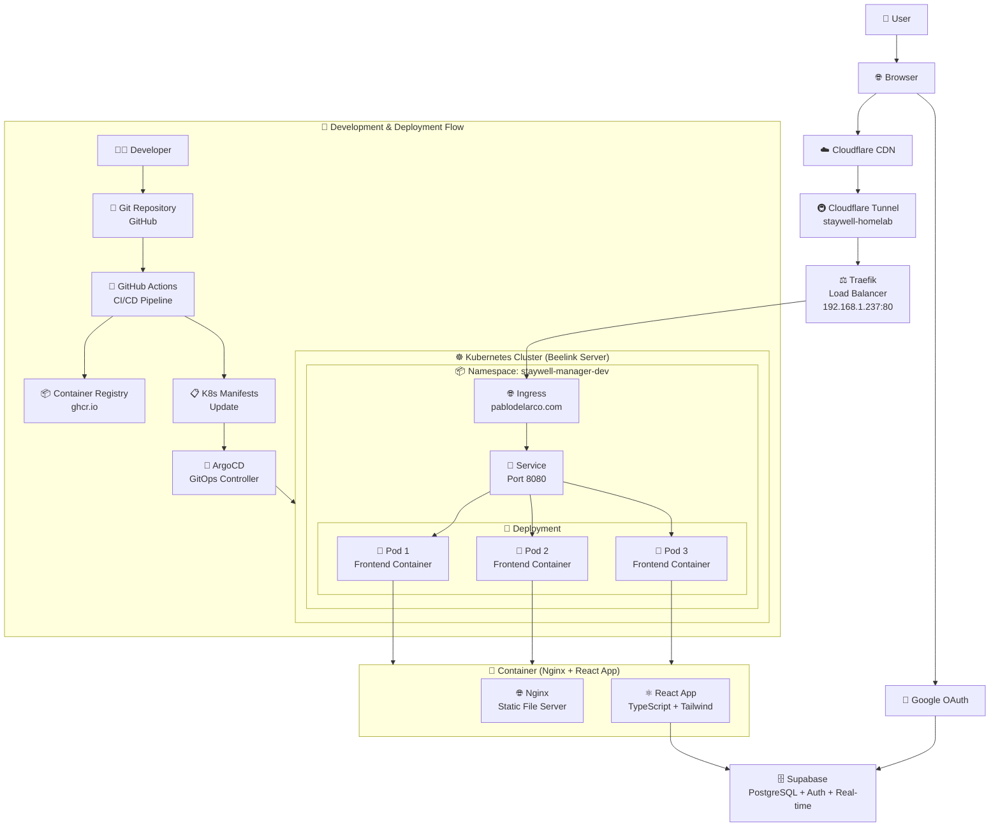
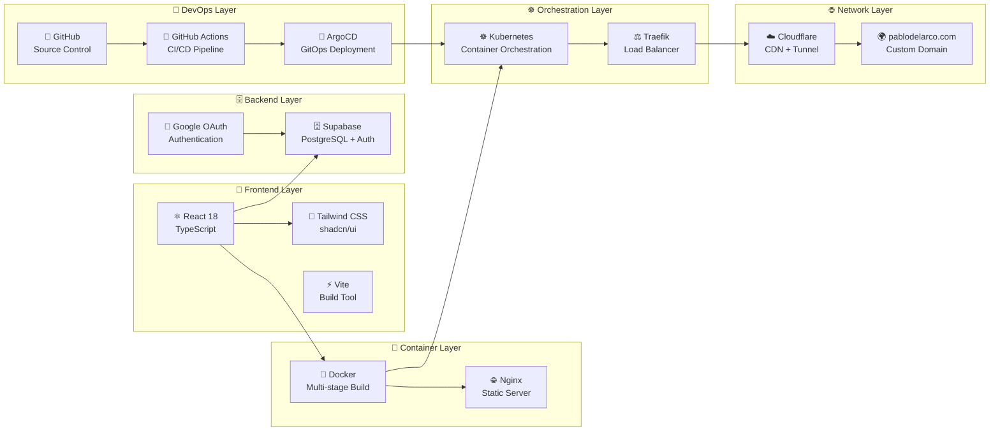
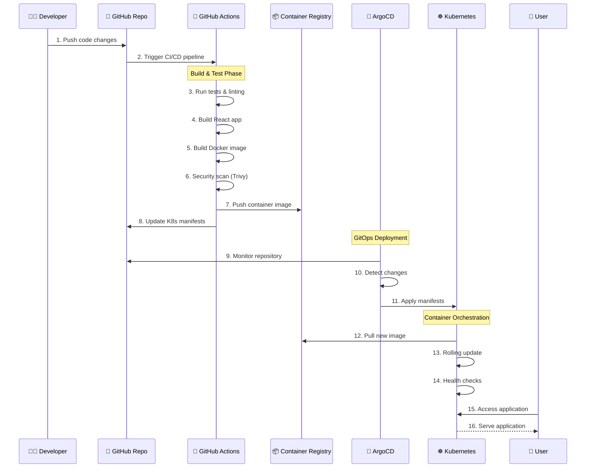

<div align="center">

# Arco Rooms

Property and tenant management SaaS, built with React and Supabase and delivered through a production-grade GitOps pipeline on Kubernetes.

[](https://github.com/pablodelarco/arco_rooms/stargazers)
[](https://github.com/pablodelarco/arco_rooms/actions/workflows/ci-cd.yml)
[](https://github.com/pablodelarco/arco_rooms)
[](https://react.dev)
[](k8s/)

</div>

## Why Arco Rooms?

Managing rental properties means juggling apartments, tenants, rent payments, and utility bills across spreadsheets and chat threads. Arco Rooms centralizes all of it in one web app. The project is also a complete, working reference for taking a modern frontend from code to production with cloud-native tooling:

- **Full property workflow** 🏠: Apartments, tenants, payments, bills, and reports managed from a single dashboard with authentication and role-protected routes.
- **GitOps by default**: Every deployment is declarative and Git-driven through ArgoCD, so changes are transparent, auditable, and easy to revert.
- **Automated pipeline**: GitHub Actions runs tests, builds multi-stage Docker images, scans them with Trivy, and updates Kubernetes manifests on every push.
- **Security built in**: OAuth 2.0 login, HTTPS end to end, non-root containers, and Kubernetes network policies.
- **Real production setup**: Traefik ingress, Cloudflare CDN and tunnel, health checks, rolling updates, and multi-environment overlays (dev, staging, prod).

## Architecture

### Complete System Architecture

```mermaid
graph TB
    %% User Layer
    User[👤 User] --> Browser[🌐 Browser]

    %% External Services
    Browser --> CF[☁️ Cloudflare CDN]
    Browser --> Google[🔐 Google OAuth]

    %% Network Layer
    CF --> Tunnel[🚇 Cloudflare Tunnel<br/>staywell-homelab]
    Tunnel --> Traefik[⚖️ Traefik<br/>Load Balancer<br/>192.168.1.237:80]

    %% Kubernetes Cluster
    subgraph K8S["☸️ Kubernetes Cluster (Beelink Server)"]
        subgraph NS["📦 Namespace: staywell-manager-dev"]
            Ingress[🌐 Ingress<br/>pablodelarco.com]
            Service[🔗 Service<br/>Port 8080]

            subgraph Deployment["🚀 Deployment"]
                Pod1[📱 Pod 1<br/>Frontend Container]
                Pod2[📱 Pod 2<br/>Frontend Container]
                Pod3[📱 Pod 3<br/>Frontend Container]
            end
        end
    end

    %% Container Details
    subgraph Container["🐳 Container (Nginx + React App)"]
        Nginx[🌐 Nginx<br/>Static File Server]
        ReactApp[⚛️ React App<br/>TypeScript + Tailwind]
    end

    %% Backend Services
    ReactApp --> Supabase[🗄️ Supabase<br/>PostgreSQL + Auth + Real-time]
    Google --> Supabase

    %% Development & Deployment Flow
    subgraph DevFlow["🔄 Development & Deployment Flow"]
        Dev[👨‍💻 Developer] --> Git[📝 Git Repository<br/>GitHub]
        Git --> GHA[🔄 GitHub Actions<br/>CI/CD Pipeline]
        GHA --> Registry[📦 Container Registry<br/>ghcr.io]
        GHA --> K8SManifests[📋 K8s Manifests<br/>Update]
        K8SManifests --> ArgoCD[🚀 ArgoCD<br/>GitOps Controller]
        ArgoCD --> K8S
    end

    %% Connections
    Traefik --> Ingress
    Ingress --> Service
    Service --> Pod1
    Service --> Pod2
    Service --> Pod3
    Pod1 --> Container
    Pod2 --> Container
    Pod3 --> Container
```

### Technology Stack

```mermaid
graph LR
    subgraph Frontend["🎨 Frontend Layer"]
        React[⚛️ React 18<br/>TypeScript]
        Tailwind[🎨 Tailwind CSS<br/>shadcn/ui]
        Vite[⚡ Vite<br/>Build Tool]
    end

    subgraph Backend["🗄️ Backend Layer"]
        Supabase[🗄️ Supabase<br/>PostgreSQL + Auth]
        OAuth[🔐 Google OAuth<br/>Authentication]
    end

    subgraph Container["🐳 Container Layer"]
        Docker[🐳 Docker<br/>Multi-stage Build]
        Nginx[🌐 Nginx<br/>Static Server]
    end

    subgraph Orchestration["☸️ Orchestration Layer"]
        K8s[☸️ Kubernetes<br/>Container Orchestration]
        Traefik[⚖️ Traefik<br/>Load Balancer]
    end

    subgraph Network["🌐 Network Layer"]
        Cloudflare[☁️ Cloudflare<br/>CDN + Tunnel]
        Domain[🌍 pablodelarco.com<br/>Custom Domain]
    end

    subgraph DevOps["🔄 DevOps Layer"]
        GitHub[📝 GitHub<br/>Source Control]
        Actions[🔄 GitHub Actions<br/>CI/CD Pipeline]
        ArgoCD[🚀 ArgoCD<br/>GitOps Deployment]
    end

    React --> Tailwind
    React --> Supabase
    OAuth --> Supabase
    React --> Docker
    Docker --> Nginx
    Docker --> K8s
    K8s --> Traefik
    Traefik --> Cloudflare
    Cloudflare --> Domain
    GitHub --> Actions
    Actions --> ArgoCD
    ArgoCD --> K8s
```

### Stack at a Glance

| Layer | Technologies |
|---|---|
| Application | React 18, TypeScript, Vite, Tailwind CSS, shadcn/ui, TanStack Query |
| Backend | Supabase (managed PostgreSQL, authentication, real-time), Google OAuth 2.0 |
| Containers | Docker multi-stage builds, Nginx static serving, non-root runtime |
| Orchestration | Kubernetes, Kustomize overlays, Traefik ingress and load balancing |
| CI/CD | GitHub Actions, Trivy vulnerability scanning, GitHub Container Registry, ArgoCD |
| Networking | Cloudflare CDN, DNS, and secure tunnel, automated HTTPS/TLS, custom domain |
| Observability | Liveness and readiness probes, resource limits and requests, GitOps deployment history |

## CI/CD and GitOps Workflow

### Deployment Flow

```mermaid
sequenceDiagram
    participant Dev as 👨‍💻 Developer
    participant Git as 📝 GitHub Repo
    participant GHA as 🔄 GitHub Actions
    participant Registry as 📦 Container Registry
    participant ArgoCD as 🚀 ArgoCD
    participant K8s as ☸️ Kubernetes
    participant User as 👤 User

    Dev->>Git: 1. Push code changes
    Git->>GHA: 2. Trigger CI/CD pipeline

    Note over GHA: Build & Test Phase
    GHA->>GHA: 3. Run tests & linting
    GHA->>GHA: 4. Build React app
    GHA->>GHA: 5. Build Docker image
    GHA->>GHA: 6. Security scan (Trivy)

    GHA->>Registry: 7. Push container image
    GHA->>Git: 8. Update K8s manifests

    Note over ArgoCD: GitOps Deployment
    ArgoCD->>Git: 9. Monitor repository
    ArgoCD->>ArgoCD: 10. Detect changes
    ArgoCD->>K8s: 11. Apply manifests

    Note over K8s: Container Orchestration
    K8s->>Registry: 12. Pull new image
    K8s->>K8s: 13. Rolling update
    K8s->>K8s: 14. Health checks

    User->>K8s: 15. Access application
    K8s-->>User: 16. Serve application
```

### Workflow Steps
1. **Push to `develop` branch**: the pipeline runs, builds container images, runs security scans, and updates the dev overlay. ArgoCD syncs to the development environment.
2. **Push to `main` branch**: the same pipeline runs, followed by ArgoCD deployment to the production cluster.
3. **GitOps at the core**: deployments remain transparent, auditable, and easily revertible.
4. **Automated testing**: ESLint, TypeScript checking, and build validation.
5. **Security scanning**: Trivy vulnerability detection on container images.
6. **Rolling deployments**: zero-downtime updates with health checks.

## Quick Start

### Prerequisites
- **Kubernetes Cluster**: K3s, EKS, GKE, or AKS
- **ArgoCD**: GitOps deployment controller
- **Traefik**: ingress controller and load balancer
- **Docker**: container runtime and build system
- **Node.js 18+**: local development and builds

### 1. Clone and Explore
```bash
git clone https://github.com/pablodelarco/arco_rooms
cd arco_rooms

# Review the CI/CD pipeline configuration
cat .github/workflows/ci-cd.yml
```

### 2. Local Development
```bash
npm ci
npm run dev

# Lint and type-check
npm run lint
npm run type-check
```

### 3. Container Build and Security Scan
```bash
# Build production-ready container
docker build -t roomio .

# Run security scan (Trivy)
trivy image roomio

# Or use docker compose for a local run
docker compose up
```

### 4. Kubernetes Deployment
```bash
# Deploy (defaults to the development overlay)
kubectl apply -k k8s/

# Monitor deployment status
kubectl get pods -n roomio-dev
kubectl describe deployment roomio-frontend -n roomio-dev

# Check ingress and networking
kubectl get ingress -n roomio-dev
kubectl get services -n roomio-dev
```

### 5. GitOps with ArgoCD
```bash
# Apply ArgoCD application manifests (dev, staging, prod)
kubectl apply -f argocd/applications/

# Monitor GitOps deployment
kubectl get applications -n argocd
kubectl describe application roomio-dev -n argocd
```

## Configuration

### Environment Variables and Secrets
```bash
# Local development configuration
cp .env.example .env.local
# Edit with your Supabase URL, anon key, and feature flags

# Kubernetes secrets management
kubectl create secret generic roomio-secrets \
  --from-literal=supabase-url="your-supabase-url" \
  --from-literal=supabase-anon-key="your-anon-key" \
  -n roomio-dev
```

### ArgoCD Repository Access
```bash
# Configure ArgoCD repository access
kubectl apply -f argocd/repository-secret.yaml
# Update with your GitHub token for private repository access
```

### Ingress and Domain
```bash
# Configure custom domain routing through the ingress manifest
kubectl apply -k k8s/
# Update DNS records to point to your Kubernetes cluster
```

### Further Documentation

| Guide | Description |
|---|---|
| [DEPLOYMENT.md](DEPLOYMENT.md) | End-to-end deployment walkthrough |
| [docs/CI-CD-PIPELINE.md](docs/CI-CD-PIPELINE.md) | Pipeline stages and configuration |
| [docs/environment-separation-guide.md](docs/environment-separation-guide.md) | Dev, staging, and prod environment strategy |
| [docs/ssl-tls-setup-guide.md](docs/ssl-tls-setup-guide.md) | SSL/TLS certificate setup |
| [docs/SSL-TLS-SECURITY.md](docs/SSL-TLS-SECURITY.md) | TLS security hardening notes |
| [docs/production-readiness-assessment.md](docs/production-readiness-assessment.md) | Production readiness checklist |
| [DNS-SETUP-GUIDE.md](DNS-SETUP-GUIDE.md) | DNS configuration for custom domains |
| [MIGRATION-GUIDE.md](MIGRATION-GUIDE.md) | Migration notes between environments |

## DevOps Practices Demonstrated

- **Infrastructure Engineering**: production-ready Kubernetes with health checks and resource management, declarative GitOps with ArgoCD, Traefik ingress with Cloudflare CDN and tunnel, and Infrastructure as Code through manifests and Kustomize overlays.
- **Pipeline Automation**: complete GitHub Actions flow from commit to production, automated vulnerability scanning and container hardening, a multi-environment promotion strategy, and instant GitOps rollbacks with deployment history.
- **Security and Reliability**: zero-downtime rolling updates with graceful shutdowns, non-root containers, Kubernetes network policies, OAuth integration, and multi-replica deployments.
- **Operations**: CDN integration and custom domain management, container and caching optimization, audit trails, and deployment validation.

## License

This project is available under the MIT License.

## Acknowledgments

Built on Kubernetes, ArgoCD, GitHub Actions, Docker, Traefik, Cloudflare, Supabase, and the React ecosystem.

---

Built by [Pablo del Arco](https://pablodelarco.com)
